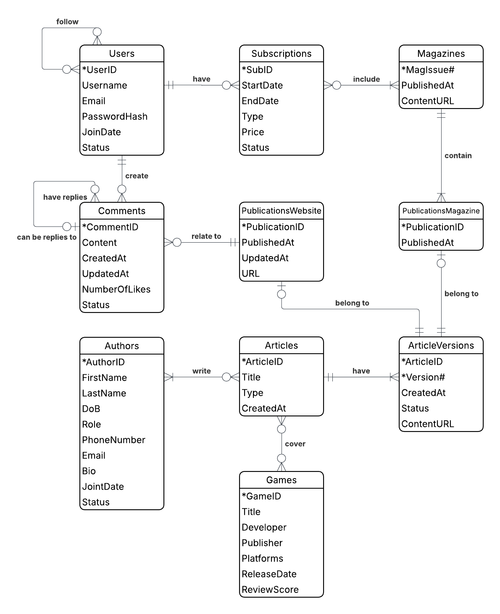
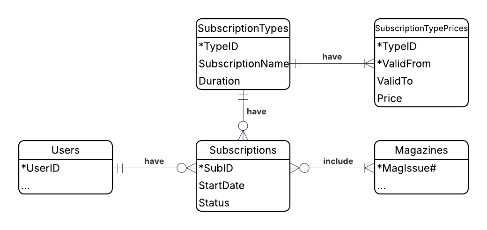
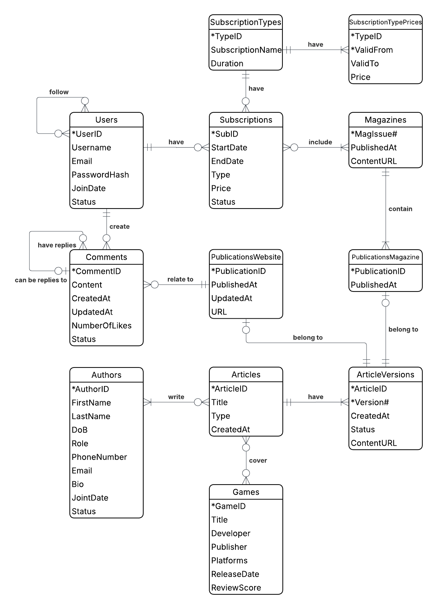

### <span style="color: #004C99;"> 1. Intro and background

Hi folks, welcome to my project on relational database design, where I've decided to build a database for the video game media outlet *GameInformer*.

So, a little bit about *GameInformer*. I am convinced that *GameInformer* has a
fascinating history of success, followed by shutdown and resurrection. 
It was established in 1991 as an in-house print video game magazine published by the video game retailer 
*FuncoLand* (which was eventually acquired by *GameStop*). Following the trend of 
commercialization of the internet in the mid-90s, *GameInformer* launched its website in 1996.
But unlike many others, *GameInformer* didn't discontinue its print version. According to Wikipedia, "in 2010, *GameInformer* became the 5th largest magazine in the US with 5 million copies sold" ahead of *Time* and *Sports Illustrated*.

In 2019-2024, amid problems at its parent company *GameStop*, *GameInformer* went through a series of layoffs and was completely shut down in August 2024 after 33 years of dedicated work (the website and even the Twitter account were plugged off). Fortunately, *GameInformer* was revived after eight months in shut down with the help of the Gunzilla Games studio. The old team reunited, and the website archive, as well as the printed version of the magazine, is back!

It's definitely a new chapter for *GameInformer* as an independent editorial outlet. So, I became curious about what kind of database could help them manage their data efficiently. Let’s summarize what *GameInformer* business looks like today. First of all, it’s an online gaming news outlet that also features reviews of a vast majority of published games, driven by a talented staff. Secondly, it’s a magazine about video games with digital and print subscription options. Finally, it’s a place for the gaming community to gather and chat. Additionally, we assume that *GameInformer* uses a subscription business model and relies on community support (ad-free!).

In the following paragraph I'll explore what kind of entity relationship model I can create for *GameInformer*.


### <span style="color: #004C99;"> 2. Entity Relationship Model

#### <span style="color: #660066;"> Entities and their attributes:

* **Articles:** ArticleID, Title, Type, Status, CreatedAt. ArticleID is the identifier. 
  * Each article when published belongs either to the magazine, the website, or both. Only website articles can be updated after publication; only minor changes are permitted, with a note to the reader indicating what was changed.
  * The *Type* attribute is selected from the list [News, Previews, Reviews, Interview, Feature]. 
  * The *CreatedAt* attribute indicates the date when the first version of the article was created.

  <br>

* **ArticleVersions:** ArticleID, Version#, CreatedAt, Status, ContentURL. ArticleID and Version# together as the identifier.
  * *Version#* domain: positive integers in ascending order.
  * Different versions of an article can be published in the magazine or on the website. For example, the version of an article published on the website may omit the exclusive material featured in the magazine version of the same article.
  * All versions of an article are created and edited by the article’s authors.
  * An article can have multiple draft versions while it is being written (version control).
  * The *Status* attribute is selected from the list [Draft, Reviewed, Published, Archived].
  * The *CreatedAt* attribute indicates the date when the current version of the article was created.

  <br>
  
* **Authors:** AuthorID, FirstName, LastName, DoB, Role, PhoneNumber, Email, Bio, JointDate, Status. AuthorID is the identifier.
  * The *Role* attribute is selected from the list [Executive Editor, Senior Editor, Editor, Contributor].
  * The *Status* attribute is selected from the list [Active, Inactive].

  <br>

* **Games:** GameID, Title, Developer, Publisher, Platforms, ReleaseDate, ReviewScore. GameID is the identifier. 
  * The *ReleaseDate* attribute can be in the future if the game is still in development, or it can be set to NULL if the release date is unknown.

  <br>

* **PublicationsWebsite:** PublicationID, PublishedAt, UpdatedAt, URL. PublicationID is the identifier.
  * Only one version of an article can be published on the website. The enforcement of this assumption will be demonstrated through the normalization process in paragraph 5.
  * Any changes to a website publication are made within the same article version.

  <br>

* **PublicationsMagazine:** PublicationID, PublishedAt. PublicationID is the identifier.
  * Only one version of an article can be published in the magazine. The enforcement of this assumption will be demonstrated through the normalization process in paragraph 5.
  
  <br>

* **Magazines:** MagIssue#, PublishedAt, ContentURL. MagIssue# is the identifier. 
  * All magazine issues are published in both print and online formats. The print and online versions of each issue contain identical content.
  * Version control of magazine issues is implemented at the application level.
  * *MagIssue#* domain: positive integers in ascending order.

  <br>

* **Subscriptions**: SubID, StartDate, EndDate, Type, Price, Status. SubID is the identifier.
  * When a subscription is renewed, a new record is created to maintain historical accuracy.
  * The *Type* attribute is selected from the list [Print+Digital, Digital Only].
  * The *Status* attribute is selected from the list [Active, Expired, Canceled]. 
  * All current subscriptions have a status of Active or Canceled (no renewal). 

  <br>
  
* **Users:** UserID, Username, Email, PasswordHash, JoinDate, Status. UserID is the identifier.
  * The *Status* attribute is selected from the list [Active, Inactive, Banned].

  <br>
  
* **Comments**: CommentID, Content, CreatedAt, UpdatedAt, NumberOfLikes, Status. CommentID is the identifier.
  * The *Status* attribute is selected from the list [Active, Flagged, Deleted].

  <br>

#### <span style="color: #660066;"> Entities' relationships are:

* An article must have one or more article versions, and each article version must belong to exactly one article.

* An author may write zero or more articles, and an article must be written at least by one (one or more) author.

* An article may cover zero or more games, and each game may be covered in zero or more articles.

* An article version may have zero or one publication on the website, and each website publication must belong to exactly one article version.

* An article version may have zero or one publication in the magazine, and each magazine publication must belong to exactly one article version.

* A magazine issue must contain one or more magazine publications, and each magazine publication must belong to exactly one magazine issue.

* A subscription includes access to one or more magazine issues, and a magazine issue may be included in zero or more subscriptions.

* A user may have zero or more subscriptions, and a subscription must belong to one and only one user.

* A user may follow zero or more other users, and a user may be followed by zero or more other users.

* A user may create zero or more comments, and a comment must belong to exactly one user.

* A comment relates to exactly one website publication, and a website publication may have zero or more comments.

* A comment may have zero or more replies, and a comment can be a reply to zero or one other comment.

  <br>

In the following paragraph, I will present this entity-relationship model as an Entity-Relationship Diagram (Crow's Foot Notation).

### <span style="color: #004C99;"> 3. Entity Relationship Diagram

```{r, out.width="80%", fig.align="center", echo=FALSE}

```


Next step is to convert the ERD to a relational model.


### <span style="color: #004C99;"> 4. Converting the ERD to the Relational Model

Here is the relational model I converted from the ERD:

* **Articles** (<u>ArticleID</u>, Title, Type, CreatedAt).

* **ArticleVersions** (<u>ArticleID (fk)</u>, <u>Version#</u>, CreatedAt, Status, ContentURL).

* **Authors** (<u>AuthorID</u>, FirstName, LastName, DoB, Role, PhoneNumber, Email, Bio, JointDate, Status).

* **Authors_Articles** (<u>ArticleID (fk)</u>, <u>AuthorID (fk)</u>).

* **Games** (<u>GameID</u>, Title, Developer, Publisher, Platforms, ReleaseDate, ReviewScore).

* **Articles_Games** (<u>ArticleID (fk)</u>, <u>GameID (fk)</u>).

* **PublicationsWebsite** (<u>PublicationID</u>, PublishedAt, UpdatedAt, URL, ArticleID (fk), Version# (fk)).

* **PublicationsMagazine** (<u>PublicationID</u>, PublishedAt, ArticleID (fk), Version# (fk), MagIssue# (fk)).

* **Magazines** (<u>MagIssue#</u>, PublishedAt, ContentURL).

* **Subscriptions** (<u>SubID</u>, StartDate, EndDate, Type, Price, Status, UserID (fk)).

* **Subscriptions_Magazines** (<u>SubID (fk)</u>, <u>MagIssue# (fk)</u>).

* **Users** (<u>UserID</u>, Username, Email, PasswordHash, JoinDate, Status).

* **Users_Users** (<u>UserID (fk)</u>, <u>FollowerID (fk)</u>).

* **Comments** (<u>CommentID</u>, Content, CreatedAt, UpdatedAt, NumberOfLikes, Status, UserID (fk), ParentCommentID (fk), PublicationID (fk)).

  <br>

The next step is to normalize the relational model to the Third Normal Form (3NF).

### <span style="color: #004C99;"> 5. Normalization Process to 3NF

#### <span style="color: #660066;"> Functional dependencies

Before normalization, I made assumptions about functional dependencies within the relations:

* **Articles** (<u>ArticleID</u>, Title, Type, CreatedAt).
  * FD1: ArticleID --> Title, Type, CreatedAt

  <br>

* **ArticleVersions** (<u>ArticleID (fk)</u>, <u>Version#</u>, CreatedAt, Status, ContentURL).
  * FD1: ArticleID, Version# --> CreatedAt, Status, ContentURL

  <br>

* **Authors** (<u>AuthorID</u>, FirstName, LastName, DoB, Role, PhoneNumber, Email, Bio, JointDate, Status).
  * FD1: AuthorID --> FirstName, LastName, DoB, Role, PhoneNumber, Email, Bio, JointDate, Status

  <br>

* **Authors_Articles** (<u>ArticleID (fk)</u>, <u>AuthorID (fk)</u>).
  * There is no non-primary-key attribute.

  <br>

* **Games** (<u>GameID</u>, Title, Developer, Publisher, Platforms, ReleaseDate, ReviewScore).
  * FD1: GameID --> Title, Developer, Publisher, Platforms, ReleaseDate, ReviewScore

  <br>

* **Articles_Games** (<u>ArticleID (fk)</u>, <u>GameID (fk)</u>).
  * There is no non-primary-key attribute.

  <br>

* **PublicationsWebsite** (<u>PublicationID</u>, PublishedAt, UpdatedAt, URL, ArticleID (fk), Version# (fk)).
  * FD1: PublicationID --> PublishedAt, UpdatedAt, URL, ArticleID, Version#
  * FD2: ArticleID --> PublicationID, PublishedAt, UpdatedAt, URL, Version# (*ArticleID* is a candidate key)

  <br>

* **PublicationsMagazine** (<u>PublicationID</u>, PublishedAt, ArticleID (fk), Version# (fk), MagIssue# (fk)).
  * FD1: PublicationID --> PublishedAt, ArticleID, Version#, MagIssue#
  * FD2: ArticleID --> PublicationID, PublishedAt, Version#, MagIssue# (*ArticleID* is a candidate key)
  * FD3: MagIssue# --> PublishedAt (transitive functional dependency)

  <br>

* **Magazines** (<u>MagIssue#</u>, PublishedAt, ContentURL).
  * FD1: MagIssue# --> PublishedAt, ContentURL

  <br>

* **Subscriptions** (<u>SubID</u>, StartDate, EndDate, Type, Price, Status, UserID (fk)).
  * FD1: SubID --> StartDate, EndDate, Type, Price, Status, UserID
  * FD2: Type, StartDate, EndDate --> Price (transitive functional dependency)

  <br>

* **Subscriptions_Magazines** (<u>SubID (fk)</u>, <u>MagIssue# (fk)</u>).
  * There is no non-primary-key attribute.

  <br>

* **Users** (<u>UserID</u>, Username, Email, PasswordHash, JoinDate, Status).
  * FD1: UserID --> Username, Email, PasswordHash, JoinDate, Status

  <br>

* **Users_Users** (<u>UserID (fk)</u>, <u>FollowerID (fk)</u>).
  * There is no non-primary-key attribute.

  <br>

* **Comments** (<u>CommentID</u>, Content, CreatedAt, UpdatedAt, NumberOfLikes, Status, UserID (fk), ParentCommentID (fk), PublicationID (fk)).
  * FD1: CommentID --> Content, CreatedAt, UpdatedAt, NumberOfLikes, Status, UserID, ParentCommentID, PublicationID 

  <br>

All relations, except for **PublicationsWebsite**, **PublicationsMagazine**, and **Subscriptions**, are in 3NF, because they are in 1NF; they have no partial functional dependencies so they are in 2NF; and they have no transitive functional dependencies so they are in 3NF.

  <br>

#### <span style="color: #660066;"> PublicationsWebsite: normalization process
  
* **PublicationsWebsite** (<u>PublicationID</u>, PublishedAt, UpdatedAt, URL, ArticleID (fk), Version# (fk)).
  * FD1: PublicationID --> PublishedAt, UpdatedAt, URL, ArticleID, Version#
  * FD2: ArticleID --> PublicationID, PublishedAt, UpdatedAt, URL, Version# (*ArticleID* is a candidate key)

  <br>

We stated in the Entity Relationship Model section that only one version of an article can be published on the website, and any changes to a website publication are made within the same article version. As a result, the *ArticleID* attribute is a candidate key that uniquely identifies a tuple within a relation. In this case, we do not need *PublicationID* as a surrogate primary key, and *ArticleID* can be used instead.

Therefore, I removed the *PublicationID* attribute from the relation and set *ArticleID (fk)* as the new primary key:

* **PublicationsWebsite** (<u>ArticleID (fk)</u>, PublishedAt, UpdatedAt, URL, Version# (fk)).
  * FD1: ArticleID --> PublishedAt, UpdatedAt, URL, Version#
 
  <br>
 
**PublicationsWebsite** is in 3NF because it has no partial or transitive functional dependencies.

  <br>

#### <span style="color: #660066;"> PublicationsMagazine: normalization process
  
* **PublicationsMagazine** (<u>PublicationID</u>, PublishedAt, ArticleID (fk), Version# (fk), MagIssue# (fk)).
  * FD1: PublicationID --> PublishedAt, ArticleID, Version#, MagIssue#
  * FD2: ArticleID --> PublicationID, PublishedAt, Version#, MagIssue# (*ArticleID* is a candidate key)
  * FD3: MagIssue# --> PublishedAt (transitive functional dependency)

  <br>

We stated in the Entity Relationship Model section that only one version of an article can be published in the magazine. As a result, the *ArticleID* attribute is a candidate key that uniquely identifies a tuple within a relation. In this case, we do not need *PublicationID* as a surrogate primary key, and *ArticleID* can be used instead.

Therefore, I removed the *PublicationID* attribute from the relation and set *ArticleID (fk)* as the new primary key:
  
* **PublicationsMagazine** (<u>ArticleID (fk)</u>, PublishedAt, Version# (fk), MagIssue# (fk)).
  * FD1: ArticleID --> PublishedAt, Version#, MagIssue#
  * FD3: MagIssue# --> PublishedAt (transitive functional dependency)

  <br>

**PublicationsMagazine** is in 2NF because it has no partial functional dependencies. However, it is not in 3NF because of FD3: MagIssue# --> PublishedAt. ArticleID --> MagIssue# --> PublishedAt is a transitive functional dependency.

To normalize the relation to 3NF, I deleted the *PublishedAt* attribute from the relation. No additional changes were required, as the **Magazines** relation already includes the functional dependency: MagIssue# --> PublishedAt, and the determinant attribute *MagIssue#* is already set as a foreign key in the **PublicationsMagazine** relation:
  
* **PublicationsMagazine** (<u>ArticleID (fk)</u>, Version# (fk), MagIssue# (fk)).
  * FD1: ArticleID --> Version#, MagIssue#

  <br>
  
Now **PublicationsMagazine** relation is in 3NF.

  <br>
 
#### <span style="color: #660066;"> Subscriptions: normalization process  
  
* **Subscriptions** (<u>SubID</u>, StartDate, EndDate, Type, Price, Status, UserID (fk)).
  * FD1: SubID --> StartDate, EndDate, Type, Price, Status, UserID
  * FD2: Type, StartDate, EndDate --> Price (transitive functional dependency)

  <br>
  
 **Subscriptions** is in 2NF because it has no partial functional dependencies. However, it is not in 3NF because of FD2. SubID --> Type, StartDate, EndDate --> Price is a transitive functional dependency. We can certainly use a systematic approach to normalize the **Subscriptions** relation: move the *Price* attribute to a new relation, where *Type*, *StartDate*, and *EndDate* would serve as the primary key and as foreign keys in the **Subscriptions** relation. However, this does not seem like an elegant solution to the problem.
 
To better manage subscription types and historical prices, I created two additional entities, as shown in the ERD below:

```{r, out.width="80%", fig.align="center", echo=FALSE}

``` 
 
<span style="color: #009999;"> **Subscriptions: entities and their attributes**

* **Subscriptions**: SubID, StartDate, Status. SubID is the identifier.
  * When a subscription is renewed, a new record is created to maintain historical accuracy. The price for the renewed subscription is updated if a price change has occurred for the applicable subscription type.
  * The *Status* attribute is selected from the list [Active, Expired, Canceled]. 
  * All current subscriptions have a status of Active or Canceled (no renewal). 
  * The attributes *Type* and *Price* were moved from the **Subscriptions** entity to **SubscriptionTypes** and **SubscriptionTypePrices**, respectively.
  * The *EndDate* attribute was removed. The end date is calculated at the application level using the *StartDate* and *Duration* of the subscription.

  <br>
  
* **SubscriptionTypes:** TypeID, SubscriptionName, Duration. TypeID is the identifier.
  * The *SubscriptionName* attribute is selected from the list [Print+Digital, Digital Only], but can be expanded to include other types.

  <br>
    
* **SubscriptionTypePrices:** TypeID, ValidFrom, ValidTo, Price. TypeID and ValidFrom together as the identifier.

  <br>

<span style="color: #009999;"> **Subscriptions: new relationships**

* A subscription type may have zero or more subscriptions, and each subscription must belong to exactly one subscription type.

* A subscription type may have one or more records in the *SubscriptionTypePrices* entity, and each instance of *SubscriptionTypePrices* must belong to exactly one subscription type.

  <br>

<span style="color: #009999;"> **Subscriptions: converting Entities to Relations**

* **Subscriptions** (<u>SubID</u>, StartDate, Status, UserID (fk), TypeID (fk)).
  * FD1: SubID --> StartDate, Status, UserID, TypeID

  <br>
  
* **SubscriptionTypes** (<u>TypeID</u>, SubscriptionName, Duration).
  * FD1: TypeID --> SubscriptionName, Duration

  <br>

* **SubscriptionTypePrices** (<u>TypeID (fk)</u>, <u>ValidFrom</u>, ValidTo, Price)
  * FD1: TypeID, ValidFrom --> ValidTo, Price

  <br>

**Subscriptions**, **SubscriptionTypes**, and **SubscriptionTypePrices** relations are in 3NF, because they are in 1NF; they have no partial functional dependencies so they are in 2NF; and they have no transitive functional dependencies so they are in 3NF.

Now all relations are in 3NF, and in the final section I will present the complete database model for *GameInformer*.


### <span style="color: #004C99;"> 6. Final Model

#### <span style="color: #660066;"> Final ERD:

```{r, out.width="80%", fig.align="center", echo=FALSE}

``` 

#### <span style="color: #660066;"> Relations normalized to 3NF:

* **Articles** (<u>ArticleID</u>, Title, Type, CreatedAt).
  * FD1: ArticleID --> Title, Type, CreatedAt

  <br>

* **ArticleVersions** (<u>ArticleID (fk)</u>, <u>Version#</u>, CreatedAt, Status, ContentURL).
  * FD1: ArticleID, Version# --> CreatedAt, Status, ContentURL

  <br>

* **Authors** (<u>AuthorID</u>, FirstName, LastName, DoB, Role, PhoneNumber, Email, Bio, JointDate, Status).
  * FD1: AuthorID --> FirstName, LastName, DoB, Role, PhoneNumber, Email, Bio, JointDate, Status

  <br>

* **Authors_Articles** (<u>ArticleID (fk)</u>, <u>AuthorID (fk)</u>).
  * There is no non-primary-key attribute.

  <br>

* **Games** (<u>GameID</u>, Title, Developer, Publisher, Platforms, ReleaseDate, ReviewScore).
  * FD1: GameID --> Title, Developer, Publisher, Platforms, ReleaseDate, ReviewScore

  <br>

* **Articles_Games** (<u>ArticleID (fk)</u>, <u>GameID (fk)</u>).
  * There is no non-primary-key attribute.

  <br>

* **PublicationsWebsite** (<u>ArticleID (fk)</u>, PublishedAt, UpdatedAt, URL, Version# (fk)).
  * FD1: ArticleID --> PublishedAt, UpdatedAt, URL, Version#

  <br>

* **PublicationsMagazine** (<u>ArticleID (fk)</u>, Version# (fk), MagIssue# (fk)).
  * FD1: ArticleID --> Version#, MagIssue#

  <br>

* **Magazines** (<u>MagIssue#</u>, PublishedAt, ContentURL).
  * FD1: MagIssue# --> PublishedAt, ContentURL

  <br>

* **Subscriptions** (<u>SubID</u>, StartDate, Status, UserID (fk), TypeID (fk)).
  * FD1: SubID --> StartDate, Status, UserID, TypeID

  <br>
  
* **SubscriptionTypes** (<u>TypeID</u>, SubscriptionName, Duration).
  * FD1: TypeID --> SubscriptionName, Duration

  <br>

* **SubscriptionTypePrices** (<u>TypeID (fk)</u>, <u>ValidFrom</u>, ValidTo, Price)
  * FD1: TypeID, ValidFrom --> ValidTo, Price

  <br>

* **Subscriptions_Magazines** (<u>SubID (fk)</u>, <u>MagIssue# (fk)</u>).
  * There is no non-primary-key attribute.

  <br>

* **Users** (<u>UserID</u>, Username, Email, PasswordHash, JoinDate, Status).
  * FD1: UserID --> Username, Email, PasswordHash, JoinDate, Status

  <br>

* **Users_Users** (<u>UserID (fk)</u>, <u>FollowerID (fk)</u>).
  * There is no non-primary-key attribute.

  <br>

* **Comments** (<u>CommentID</u>, Content, CreatedAt, UpdatedAt, NumberOfLikes, Status, UserID (fk), ParentCommentID (fk), PublicationID (fk)).
  * FD1: CommentID --> Content, CreatedAt, UpdatedAt, NumberOfLikes, Status, UserID, ParentCommentID, PublicationID 

  <br>
