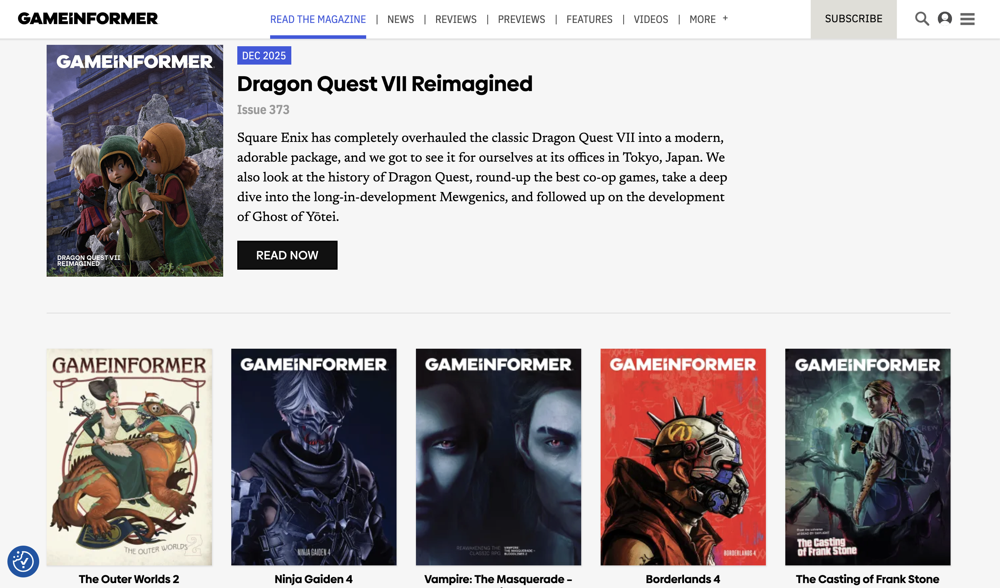
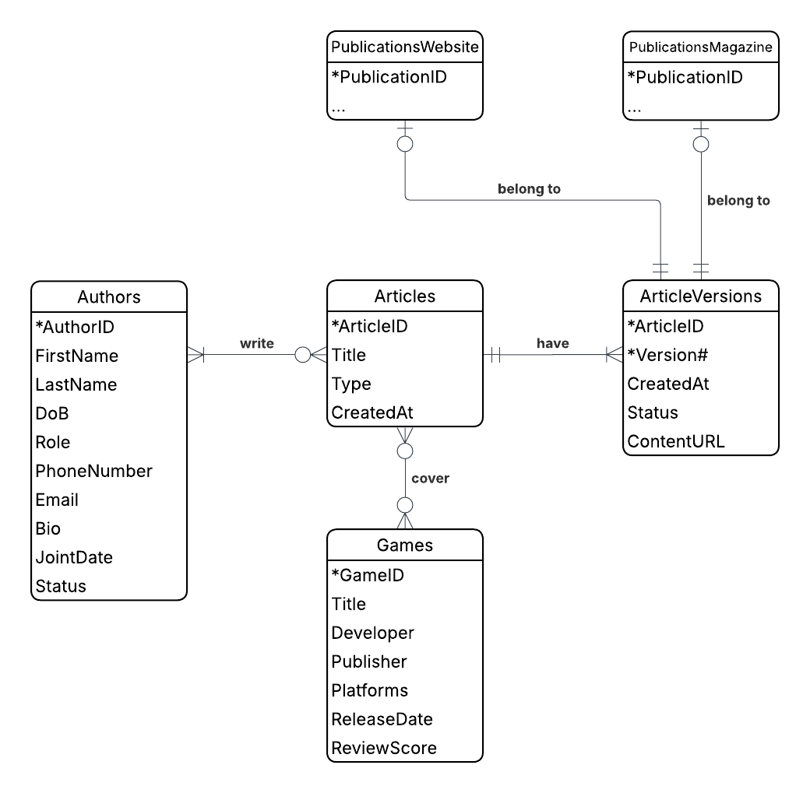
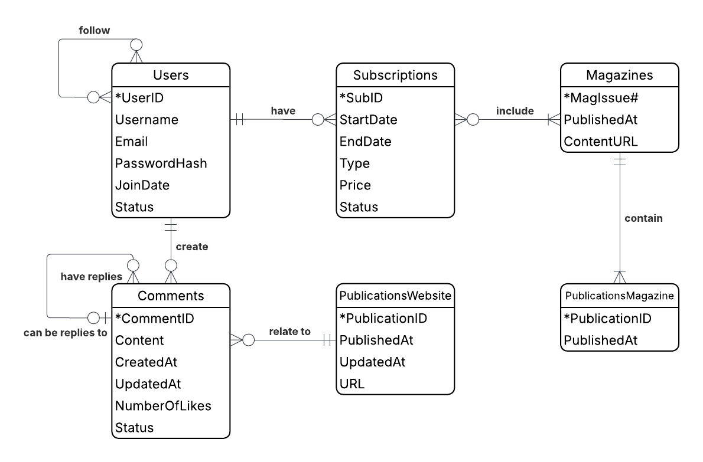
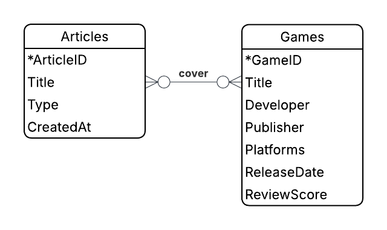
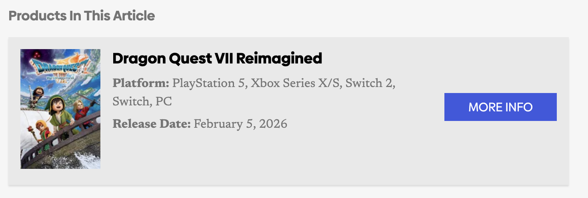
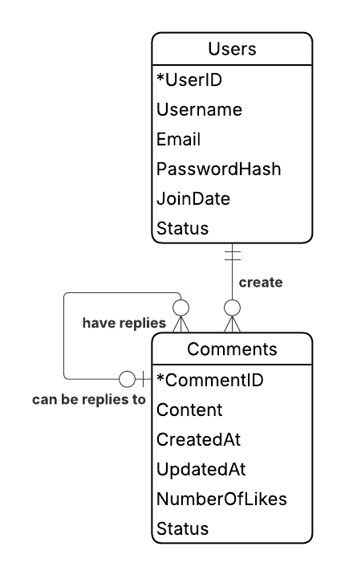

## Introduction

```{r, out.width="100%", fig.align="center", echo=FALSE}

```


## Entity Relationship Diagram

```{r, out.width="50%", fig.align="center", echo=FALSE}
knitr::include_graphics("images/ERD Practice - ERD for Project _ conceptual.png")
```


## Articles

```{r, out.width="60%", fig.align="center", echo=FALSE}

```


## Publications

```{r, out.width="80%", fig.align="center", echo=FALSE}

```

## Entity Relationship Diagram

```{r, out.width="50%", fig.align="center", echo=FALSE}
knitr::include_graphics("images/ERD Practice - ERD for Project _ conceptual.png")
```


## Binary, Many to Many

:::: columns

::: column

```{r, out.width="100%", fig.align="center", echo=FALSE}

```

```{r, out.width="130%", fig.align="center", echo=FALSE}

```

:::

::: column 

::: {style="font-size: 90%;"}

- **Articles** (<u>ArticleID</u>, Title, Type, CreatedAt)

- **Games** (<u>GameID</u>, Title, Developer, Publisher, Platforms, ReleaseDate, ReviewScore)

- **Articles_Games** (<u>ArticleID (fk)</u>, <u>GameID (fk)</u>)

:::

:::

::::


## One to Many (Binary and Unary)

:::: columns

::: column

```{r, out.width="70%", fig.align="center", echo=FALSE}

```

:::

::: column

::: {style="font-size: 90%;"}

- **Users** (<u>UserID</u>, Username, Email, PasswordHash, JoinDate, Status)

- **Comments** (<u>CommentID</u>, Content, CreatedAt, UpdatedAt, NumberOfLikes, Status, UserID (fk), ParentCommentID (fk))

:::

:::

::::

::: {style="font-size: 45%;"}

## <span style="font-size: 110%;">Relational Model</span>

- **Articles** (<u>ArticleID</u>, Title, Type, CreatedAt).

- **ArticleVersions** (<u>ArticleID (fk)</u>, <u>Version#</u>, CreatedAt, Status, ContentURL).

- **Authors** (<u>AuthorID</u>, FirstName, LastName, DoB, Role, PhoneNumber, Email, Bio, JointDate, Status).

- **Authors_Articles** (<u>ArticleID (fk)</u>, <u>AuthorID (fk)</u>).

- **Games** (<u>GameID</u>, Title, Developer, Publisher, Platforms, ReleaseDate, ReviewScore).

- **Articles_Games** (<u>ArticleID (fk)</u>, <u>GameID (fk)</u>).

- **PublicationsWebsite** (<u>PublicationID</u>, PublishedAt, UpdatedAt, URL, ArticleID (fk), Version# (fk)).

- **PublicationsMagazine** (<u>PublicationID</u>, PublishedAt, ArticleID (fk), Version# (fk), MagIssue# (fk)).

- **Magazines** (<u>MagIssue#</u>, PublishedAt, ContentURL).

- **Subscriptions** (<u>SubID</u>, StartDate, EndDate, Type, Price, Status, UserID (fk)).

- **Subscriptions_Magazines** (<u>SubID (fk)</u>, <u>MagIssue# (fk)</u>).

- **Users** (<u>UserID</u>, Username, Email, PasswordHash, JoinDate, Status).

- **Users_Users** (<u>UserID (fk)</u>, <u>FollowerID (fk)</u>).

- **Comments** (<u>CommentID</u>, Content, CreatedAt, UpdatedAt, NumberOfLikes, Status, UserID (fk), ParentCommentID (fk), PublicationID (fk)).

:::


## Publications: normalization process

:::: columns

::: column

```{r, out.width="90%", fig.align="center", echo=FALSE}

```

:::

::: column

::: {style="font-size: 65%;"}

- **PublicationsWebsite** (<u>PublicationID</u>, PublishedAt, UpdatedAt, URL, ArticleID (fk), Version# (fk))
  - FD1: PublicationID --> PublishedAt, UpdatedAt, URL, ArticleID, Version#
  - FD2: ArticleID --> PublicationID, PublishedAt, UpdatedAt, URL, Version#
  
&dArr;

- **PublicationsWebsite** (<u>ArticleID (fk)</u>, PublishedAt, UpdatedAt, URL, Version# (fk))
  - FD1: ArticleID --> PublishedAt, UpdatedAt, URL, Version#

:::

:::

::::


## Publications: normalization process

:::: columns

::: column

```{r, out.width="90%", fig.align="center", echo=FALSE}

```

:::

::: column

::: {style="font-size: 50%;"}

- **PublicationsMagazine** (<u>PublicationID</u>, PublishedAt, ArticleID (fk), Version# (fk), MagIssue# (fk))
  - FD1: PublicationID --> PublishedAt, ArticleID, Version#, MagIssue#
  - FD2: ArticleID --> PublicationID, PublishedAt, Version#, MagIssue# 
  - FD3: MagIssue# --> PublishedAt
  
&dArr;

- **PublicationsMagazine** (<u>ArticleID (fk)</u>, PublishedAt, Version# (fk), MagIssue# (fk))
  - FD1: ArticleID --> PublishedAt, Version#, MagIssue#
  - FD3: MagIssue# --> PublishedAt

&dArr;

- **PublicationsMagazine** (<u>ArticleID (fk)</u>, Version# (fk), MagIssue# (fk))
  - FD1: ArticleID --> Version#, MagIssue#
 
- **Magazines** (<u>MagIssue#</u>, PublishedAt, ContentURL)
  
:::

:::

::::


## <span style="font-size: 80%;">Subscriptions: normalization process</span>

::: {style="font-size: 50%; text-align: left;"}

```{r, out.width="55%", fig.align="center", echo=FALSE}
knitr::include_graphics("images/ERD Practice - Subscriptions.png")
``` 

- **Subscriptions** (<u>SubID</u>, StartDate, EndDate, Type, Price, Status, UserID (fk))
  - FD1: SubID --> StartDate, EndDate, Type, Price, Status, UserID
  - FD2: Type, StartDate, EndDate --> Price

:::

:::{style="font-size: 50%;"}

&dArr;

:::

::: {style="font-size: 50%; text-align: left;"}

- **Subscriptions** (<u>SubID</u>, StartDate, Status, UserID (fk), TypeID (fk)).
  - FD1: SubID --> StartDate, Status, UserID, TypeID

- **SubscriptionTypes** (<u>TypeID</u>, SubscriptionName, Duration).
  - FD1: TypeID --> SubscriptionName, Duration

- **SubscriptionTypePrices** (<u>TypeID (fk)</u>, <u>ValidFrom</u>, ValidTo, Price)
  - FD1: TypeID, ValidFrom --> ValidTo, Price

:::


## Thanks for watching! {data-background-image="images/gif.gif" data-background-size="30%" data-background-repeat="no-repeat"}